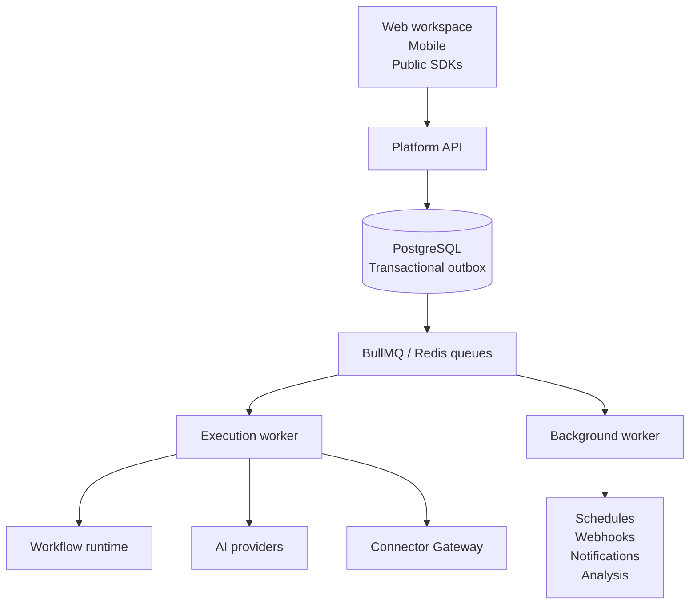

# Linea

Linea is a durable AI workflow platform for building, operating, and embedding
automations that combine models, data, human decisions, and governed external
actions.

Workflows run as versioned graphs on queue-backed workers. Executions persist
their progress, checkpoints, usage, and step history so they can recover from
process failure, pause for people or time, replay individual steps, and feed
regression suites.

**Status: pre-1.0 and under active development.** The workflow builder,
durable runtime, public application protocol, SDKs, approvals, Connections,
Action Consent, and Google and GitHub connector families are implemented.
Interfaces may still change before a stable release. Owned knowledge-base and
RAG infrastructure, arbitrary MCP tools, and sandboxed code execution are not
currently shipped.

## What Linea supports

- Visual authoring for versioned workflow graphs with manual, API, webhook,
  schedule, and chat entry points.
- Durable Postgres and BullMQ execution with checkpoints, leases, waits,
  approvals, cancellation, crash recovery, and step replay.
- AI completions, structured extraction, tool-calling loops, usage and cost
  accounting, and regression testing from saved executions and conversations.
- Public Applications with immutable Workflow Contracts, scoped Application
  keys, External Subjects, Conversations, and DPoP-bound End-User Sessions.
- Server, browser, native, React, webhook-verification, and optional CopilotKit
  SDK surfaces built over the same versioned `/v1` protocol.
- Application-scoped Google and GitHub Connections with encrypted credentials,
  provider-account isolation, registered operations, and bounded results.
- Exact-intent consent for connector side effects through immutable Action
  Intents, existing Approval Requests and Decisions, redacted audit views, and
  revocation enforcement.
- Realtime execution updates, transactional event delivery, signed webhooks,
  notifications, signals, and mobile monitoring and approvals.

## Architecture



The shared protocol and runtime registries keep browser-safe contracts
separate from server-only execution, credentials, and authorization. External
provider writes are enforced by the Connector Gateway rather than by optional
workflow branches.

## Stack

- React 19, TanStack Start, Tailwind CSS, and `@linea/ui`
- NestJS APIs and workers
- PostgreSQL with Drizzle ORM and pgvector available for future knowledge work
- Redis and BullMQ
- better-auth for workspace authentication
- Anthropic and OpenAI-compatible model providers
- pnpm workspaces and Turborepo

## Quick start

**Prerequisites:** Node.js 20+, pnpm 10.33+, and Docker.

```bash
pnpm install

pnpm db:up
pnpm queue:up

cp .env.example .env
pnpm db:migrate

pnpm dev
```

At minimum, replace the development placeholders for
`BETTER_AUTH_SECRET`, `SECRETS_ENCRYPTION_KEY`,
`CONNECTION_CREDENTIAL_KEYS`, and any email or provider integration you want
to exercise. The complete variable guide is in
[CONTRIBUTING.md](CONTRIBUTING.md).

The web workspace runs at <http://localhost:3001>, the Platform API at
<http://localhost:3000>, its health check at
<http://localhost:3000/v1/health>, and the documentation site at
<http://localhost:3002>.

## Run the example workflow

With `pnpm dev` running, configure at least one of
`ANTHROPIC_API_KEY`, `OPENAI_API_KEY`, `GROQ_API_KEY`, or `XAI_API_KEY`, then
run:

```bash
pnpm demo
```

The command finds or creates its workspace and workflow, starts a real queued
execution, and prints the step trace. The graph is stored in
[`examples/pending-todo.workflow.json`](examples/pending-todo.workflow.json).

## Verify the public launch boundaries

The required launch gates use local deterministic providers while exercising
the real API, Postgres, Redis, queues, workers, SDK packages, and public
contracts:

```bash
pnpm test:launch
pnpm test:connections-launch
```

Credentialed Google and GitHub smoke tests are intentionally separate from
required CI:

```bash
pnpm test:connections-smoke
```

## Monorepo layout

```text
apps/
  web/                workspace dashboard and workflow builder
  platform-api/       workspace and public /v1 HTTP interfaces
  execution-worker/   graph execution, checkpoints, replay, and connectors
  background-worker/  schedules, outbox delivery, notifications, and analysis
  mobile/             Expo operator monitoring and approvals
  docs/               Next.js and Fumadocs documentation site
  run-gateway/        reserved scaffold for future sandbox execution

packages/
  protocol/           public resources, operations, events, and errors
  sdk/                server, end-user, and webhook TypeScript clients
  sdk-react/          headless React hooks and CopilotKit adapter
  runtime/            workflow schemas, node registry, and graph interpreter
  connectors/         Connector Gateway and Google/GitHub operations
  ai/                 provider registry, adapters, key resolution, and pricing
  db/                 Drizzle schemas, repositories, encryption, and migrations
  queue/              BullMQ queues and dispatch contracts
  auth/               better-auth configuration and email delivery
  ui/                 shared React primitives and design tokens
  config/             shared lint and TypeScript configuration
  types/              shared internal TypeScript types
  sandbox-provider/   reserved scaffold for future sandbox implementations
```

See [docs/repo-structure.md](docs/repo-structure.md) for ownership and
dependency rules, [docs/product-vision.md](docs/product-vision.md) for product
direction, and [docs/roadmap.md](docs/roadmap.md) for strategic sequencing.

## SDKs

- [`@linea/sdk`](packages/sdk/README.md) provides trusted server clients,
  browser/native End-User sessions, and webhook verification.
- [`@linea/sdk-react`](packages/sdk-react/README.md) provides headless React
  hooks, optional approval presentation, and the CopilotKit adapter.
- `@linea/protocol` is the canonical public wire contract consumed by the API
  and both SDK packages.

These packages are currently workspace-internal and are not published to npm.

## Contributing

Read [CONTRIBUTING.md](CONTRIBUTING.md) for setup, repository conventions, and
the pull-request process, followed by the mandatory coding rules in
[AGENTS.md](AGENTS.md). Participation is governed by our
[Code of Conduct](CODE_OF_CONDUCT.md).

Report vulnerabilities through [SECURITY.md](SECURITY.md), not a public issue.

## License

[Apache License 2.0](LICENSE).
