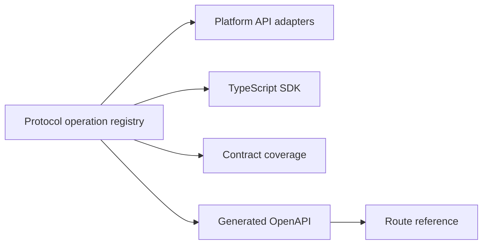

All HTTP endpoints live under `/v1`. Only operations registered as public
developer operations are compatibility contracts; first-party dashboard routes
can share the prefix without becoming public API.

## Public surfaces

| Surface              | Used by                                          | Credential                           |
| -------------------- | ------------------------------------------------ | ------------------------------------ |
| Workspace operations | Operator backends and automation                 | Workspace key                        |
| Application runtime  | A deployed Operator application backend          | Application key                      |
| End-user runtime     | Browser or mobile clients acting for an End User | End-User Session with DPoP           |
| Realtime events      | Operator UI and approved runtime clients         | Surface-specific authenticated token |

The operation registry in `packages/protocol/src/operations` owns method,
path, request schema, response schema, stable errors, and public visibility.
The API, SDKs, and contract tests consume that registry. Run
`pnpm check:contracts` to verify the generated
[OpenAPI document](https://github.com/linea-org/linea/blob/main/docs/openapi.json)
and [route reference](https://github.com/linea-org/linea/blob/main/docs/route-reference.md).

## Current operation groups

- Applications, keys, workflow bindings, and external subjects
- Conversations, messages, and executions
- End-User Session authorization and exchange
- Approval requests and immutable decisions
- Ordered end-user events

<Callout type="info" title="Generated reference">
  Conceptual guides are written by hand. Endpoint reference is generated from
  protocol definitions so request and response shapes cannot drift from code.
</Callout>

<DocsLinks
  items={[
    {
      title: "Authentication",
      href: "/docs/api/authentication",
    },
    {
      title: "API conventions",
      href: "/docs/api/conventions",
    },
    {
      title: "Security model",
      href: "/docs/security",
    },
  ]}
/>
