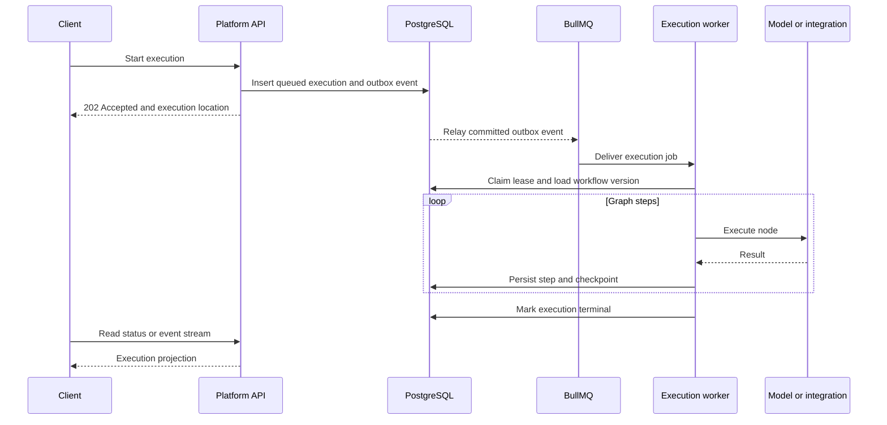

An execution is one instance of an immutable workflow version running. The term
**execution** is used consistently in tables, APIs, events, and code.

## Delivery guarantees

The queue is a delivery mechanism, while PostgreSQL is the authority for
execution state. The outbox closes the gap between committing state and
publishing work. Worker leases allow recovery when a process disappears.

| Concern              | Mechanism                                      |
| -------------------- | ---------------------------------------------- |
| Queue delivery       | At least once                                  |
| Duplicate work       | Lease claims and idempotency keys              |
| Resume               | Latest durable checkpoint                      |
| Workflow consistency | Immutable selected version                     |
| Event ordering       | Persisted sequence within the owning stream    |
| Side effects         | Connector-specific idempotency where available |

## Step records

Each attempt records its node identity, sequence, status, input/output, error,
timing, trace identifiers, token usage, and cost. This OTel-shaped history
supports inspection today and replay or evaluation without inventing a second
execution record later.

<Callout type="info" title="Failure is explicit">
  A failed handler does not silently substitute a value. The step and execution
  transition to an observable failure state, preserving the error boundary.
</Callout>
