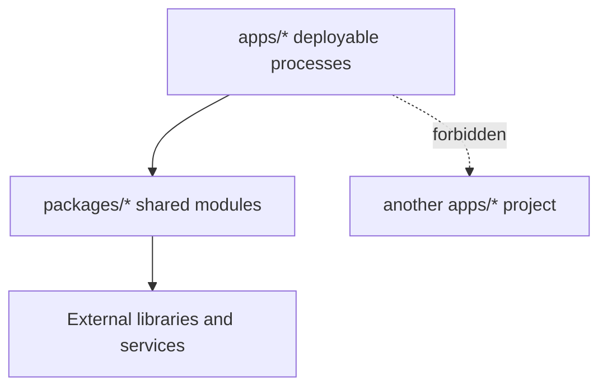

## Applications

| Application              | Role                                                                    | Runtime                    |
| ------------------------ | ----------------------------------------------------------------------- | -------------------------- |
| `apps/web`               | Workflow authoring, workspace administration, and operational UI        | TanStack Start             |
| `apps/mobile`            | Workspace-member monitoring, approvals, and push notifications          | Expo and React Native      |
| `apps/platform-api`      | Versioned REST API, realtime events, auth, and control-plane operations | NestJS                     |
| `apps/execution-worker`  | Queue consumer and workflow execution driver                            | NestJS application context |
| `apps/background-worker` | Schedules, analysis, and asynchronous maintenance                       | NestJS application context |
| `apps/run-gateway`       | Planned isolated execution gateway                                      | Not implemented yet        |
| `apps/docs`              | Architecture, API, security, and contributor knowledge                  | Next.js and Fumadocs       |

## Shared packages

| Package             | Owns                                                                      |
| ------------------- | ------------------------------------------------------------------------- |
| `@linea/ai`         | Provider adapters, model metadata, and normalized AI calls                |
| `@linea/auth`       | Better Auth configuration and shared authentication behavior              |
| `@linea/config`     | Shared TypeScript, ESLint, and environment configuration                  |
| `@linea/db`         | Drizzle schema, repositories, transactions, and migrations                |
| `@linea/protocol`   | Public operations, schemas, events, enums, and stable errors              |
| `@linea/queue`      | BullMQ queues, job payloads, delivery, and worker helpers                 |
| `@linea/runtime`    | Workflow schema, node definitions, expression handling, and graph walking |
| `@linea/sdk`        | Server and end-user client interfaces over the public protocol            |
| `@linea/types`      | Small cross-package types that have no deeper owner                       |
| `@linea/sdk-react`  | Headless React bindings for End-User applications                         |
| `@linea/ui`         | Shared React design-system primitives                                     |
| `@linea/connectors` | Planned connector boundary; no runtime implementation yet                 |

<Callout title="Status matters">
  Some directories are intentional placeholders for future boundaries. Check a
  package&apos;s scripts and source before assuming that its planned
  responsibility is implemented.
</Callout>

## Dependency rule

Keeping dependencies pointed toward shared modules allows each application to
build and deploy independently while keeping a route, SDK method, schema, and
documentation change in one repository and one pull request.
