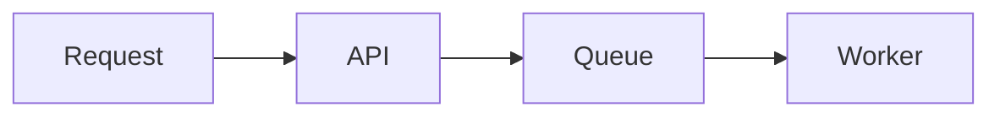

The documentation site lives in `apps/docs` and participates in the pnpm and
Turborepo workspace. Pages live under `apps/docs/content/docs` and are reviewed
through ordinary pull requests.

## Add or edit a page

<Steps>

### Find the owning section

Architecture explains boundaries and flows, API explains public behavior,
Security explains threats and invariants, and Decisions preserves trade-offs.

### Write Markdown or MDX

Each page begins with a title and description:

```mdx
---
title: Durable executions
description: How Linea recovers workflow execution after interruption.
---
```

### Place the page in navigation

Add its filename to the nearest `meta.json`. Navigation order is explicit so a
new page does not appear in an arbitrary location.

### Preview and verify

```bash
pnpm exec turbo dev --filter=@linea/docs
pnpm --filter @linea/docs lint
pnpm --filter @linea/docs typecheck
pnpm --filter @linea/docs build
pnpm format:check
```

</Steps>

## Supported content

### Tables

GitHub-flavored Markdown tables render without custom components.

| Use                   | Prefer              |
| --------------------- | ------------------- |
| Exact mappings        | Table               |
| State or request flow | Mermaid diagram     |
| Ordered procedure     | `Steps` component   |
| Parallel alternatives | `Tabs` component    |
| Important caveat      | `Callout` component |

### Mermaid diagrams

Use fenced `mermaid` blocks. Keep node labels short and explain the important
invariants in prose below the diagram.

````md

````

### Tabs and callouts

<Tabs items={["pnpm", "npm"]}>
  <Tab value="pnpm">`pnpm --filter @linea/docs dev`</Tab>
  <Tab value="npm">
    The repository standard is pnpm; npm is not supported for workspace tasks.
  </Tab>
</Tabs>

<Callout title="Document the why">
  Prefer contracts, boundaries, examples, and surprising constraints over a
  prose copy of implementation details visible in the source.
</Callout>

## Review expectations

- Update docs in the same PR that changes a public contract or architecture.
- Link to the code-owned source of truth instead of duplicating large schemas.
- Mark planned behavior clearly; do not describe it as available.
- Do not publish credentials, customer data, private endpoints, or exploit details.
- Keep diagrams editable as text whenever Mermaid can express them clearly.

Read the repository&apos;s full
[contribution guide](https://github.com/linea-org/linea/blob/main/CONTRIBUTING.md)
before opening a pull request.
