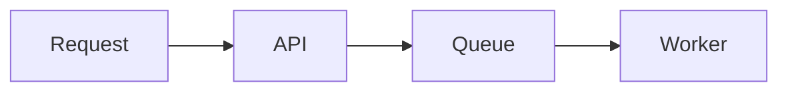

Linea is a pnpm and Turborepo monorepo. Contributions span the apps, shared
packages, tests, and documentation. Start with [local setup](./getting-started.mdx),
then read the repository's [contribution guide](https://github.com/linea-org/linea/blob/main/CONTRIBUTING.md)
and [agent rules](https://github.com/linea-org/linea/blob/main/AGENTS.md) for
the complete coding, branching, and pull-request rules.

## Understand the system

An Operator authors a versioned Workflow in a workspace. An Application can
expose a Workflow Contract to its End Users, whose Conversations and Executions
remain isolated. The Platform API records durable state in PostgreSQL; queues
deliver work to execution and background workers. Start with the
[architecture overview](./architecture/index.mdx) and
[execution flow](./architecture/execution-flow.mdx).

| Question                               | Start here                                                                              |
| -------------------------------------- | --------------------------------------------------------------------------------------- |
| What do these terms mean?              | [`CONTEXT.md`](https://github.com/linea-org/linea/blob/main/CONTEXT.md)                 |
| Which process or package owns this?    | [Repository map](./architecture/repository-map.mdx)                                     |
| Which credential can call an endpoint? | [API overview](./api/index.mdx) and [trust boundaries](./security/trust-boundaries.mdx) |
| Why was a boundary chosen?             | [Architecture decisions](./decisions.mdx)                                               |

## Find the owning code

| Change                          | Start in                                            | Check alongside it                                 |
| ------------------------------- | --------------------------------------------------- | -------------------------------------------------- |
| Operator UI                     | `apps/web` or `apps/mobile`                         | `@linea/ui` and Platform API projections           |
| Public REST operation           | `packages/protocol`                                 | `apps/platform-api`, SDK method, contract coverage |
| Workflow node or graph behavior | `packages/runtime`                                  | `apps/execution-worker`, tests, builder metadata   |
| Execution or scheduled work     | `apps/execution-worker` or `apps/background-worker` | `packages/queue` and durable DB state              |
| Data ownership or persistence   | `packages/db`                                       | Generated migration and real-Postgres tests        |
| AI model behavior               | `packages/ai`                                       | The node or service using it                       |
| End-user integration            | `packages/sdk` or `packages/sdk-react`              | Public protocol and packed-package tests           |

Apps never import from other apps. Shared contracts and behavior belong in the
owning `packages/*` module. Some directories are placeholders, so check their
source before treating a planned capability as implemented.

## Ship a focused change

Use one `feat/<slug>` or `fix/<slug>` branch per issue. A public API change
starts in the protocol registry and continues through the API adapter, SDK,
contract checks, and docs. A database change includes its generated Drizzle
migration; a new node starts with its runtime definition and registration.
Security changes must preserve the [two-plane trust model](./security/trust-boundaries.mdx).

Run the affected package's tests while working, then the repository checks
before opening a PR. Database and integration tests use real PostgreSQL; the
full suite also needs Redis.

```bash
pnpm --filter @linea/db test
pnpm lint
pnpm typecheck
pnpm format:check
pnpm test
```

Run `pnpm check:contracts` for public operations and `pnpm test:launch` for
the end-user approval protocol. Link the issue and describe the changed
behavior, boundary, migration, and verification in your PR; address CI and
review findings before merging.

## Contribute documentation

The docs site lives in `apps/docs`; pages are in `apps/docs/content/docs` and
use the same PR process as code. The following steps cover docs-specific work.

## Add or edit a page

<Steps>

### Find the owning section

Architecture explains boundaries and flows, API explains public behavior,
Security explains threats and invariants, and Decisions preserves trade-offs.

### Write Markdown or MDX

Each page begins with a title and description:

```mdx
---
title: Durable executions
description: How Linea recovers workflow execution after interruption.
---
```

### Place the page in navigation

Add its filename to the nearest `meta.json`. Navigation order is explicit so a
new page does not appear in an arbitrary location.

### Preview and verify

```bash
pnpm exec turbo dev --filter=@linea/docs
pnpm --filter @linea/docs lint
pnpm --filter @linea/docs typecheck
pnpm --filter @linea/docs build
pnpm format:check
```

</Steps>

## Supported content

### Tables

GitHub-flavored Markdown tables render without custom components.

| Use                   | Prefer              |
| --------------------- | ------------------- |
| Exact mappings        | Table               |
| State or request flow | Mermaid diagram     |
| Ordered procedure     | `Steps` component   |
| Parallel alternatives | `Tabs` component    |
| Important caveat      | `Callout` component |

### Mermaid diagrams

Use fenced `mermaid` blocks. Keep node labels short and explain the important
invariants in prose below the diagram.

````md

````

### Tabs and callouts

<Tabs items={["pnpm", "npm"]}>
  <Tab value="pnpm">`pnpm --filter @linea/docs dev`</Tab>
  <Tab value="npm">
    The repository standard is pnpm; npm is not supported for workspace tasks.
  </Tab>
</Tabs>

<Callout title="Document the why">
  Prefer contracts, boundaries, examples, and surprising constraints over a
  prose copy of implementation details visible in the source.
</Callout>

## Review expectations

- Update docs in the same PR that changes a public contract or architecture.
- Link to the code-owned source of truth instead of duplicating large schemas.
- Mark planned behavior clearly; do not describe it as available.
- Do not publish credentials, customer data, private endpoints, or exploit details.
- Keep diagrams editable as text whenever Mermaid can express them clearly.

Read the repository&apos;s full
[contribution guide](https://github.com/linea-org/linea/blob/main/CONTRIBUTING.md)
before opening a pull request.
