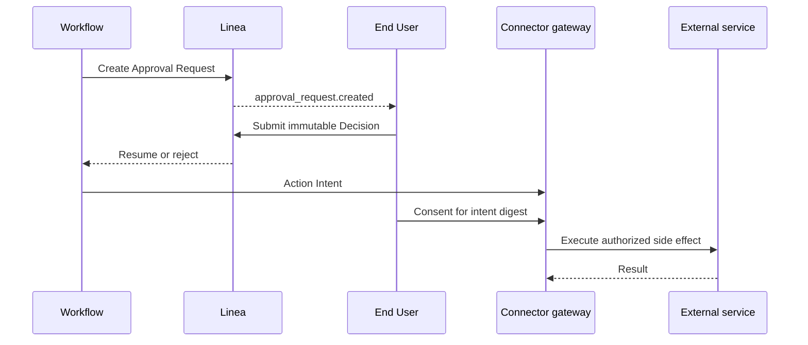

An Approval Request and an Action Consent solve different problems. An Approval
Request pauses an execution for a human decision. Action Consent authorizes a
specific external side effect.

## Approval lifecycle

- The request is durable and owned by the approver identity.
- A browser session ending does not orphan the request.
- Approve and reject responses are immutable Decisions.
- Timeout and cancellation are explicit terminal outcomes.
- A decided request cannot accept a second Decision.

## Action consent

An Action Intent describes the target, operation, and relevant parameters
before the side effect occurs. Consent covers the digest of that exact intent
or an explicit policy broad enough to include it. The connector gateway checks
consent at the final side-effect boundary.

This prevents a compromised or buggy workflow executor from turning approval
for one action into authority for a different action.
