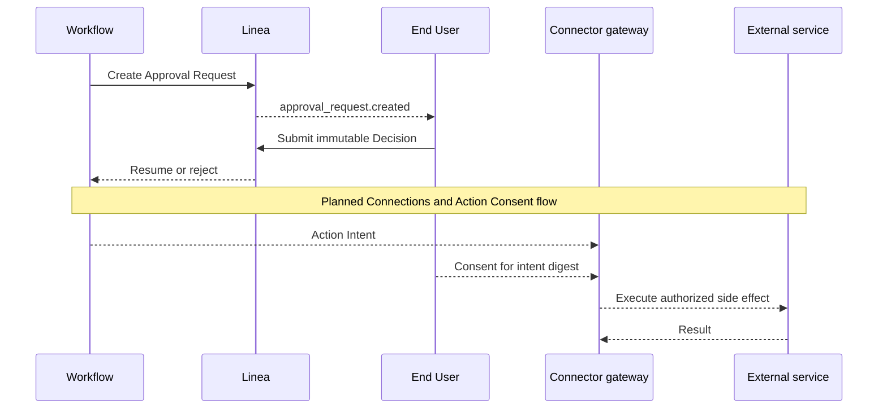

An Approval Request pauses an execution for a human decision. The planned
Connections milestone adds Action Consent to authorize a specific external
side effect. Action Consent is not enforced by the current release.

## Approval lifecycle

- The request is durable and owned by the approver identity.
- A browser session ending does not orphan the request.
- Approve and reject responses are immutable Decisions.
- Timeout and cancellation are explicit terminal outcomes.
- A decided request cannot accept a second Decision.

## Action consent

Action Consent is a planned control, not a capability in the current release.
In that design, an Action Intent describes the target, operation, and relevant
parameters before the side effect occurs. Consent covers the digest of that
exact intent or an explicit policy broad enough to include it. Once implemented,
the connector gateway will check consent at the final side-effect boundary.

This boundary is intended to prevent a compromised or buggy workflow executor
from turning approval for one action into authority for a different action.
