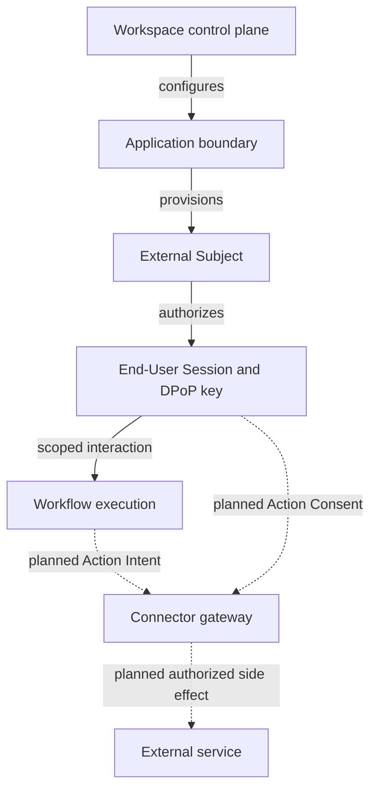

Linea is multi-tenant and executes user-defined workflows that can reach models
and external services. Security is therefore expressed as explicit boundaries
and independently scoped capabilities, not one all-powerful token.

## Core invariants

1. Every tenant-owned read and write is scoped to a workspace.
2. Application and Workspace Keys have different authority and are not substitutes.
3. End-User Sessions are short-lived, subject-bound, audience-bound capabilities.
4. Public browser requests prove possession with DPoP and enforce trusted origins.
5. Approval ownership follows the approver identity, not an ephemeral browser session.
6. A Decision is immutable and separate from the Approval Request it answers.
7. Provider and connector secrets remain on trusted server boundaries.

The planned Connections milestone adds another invariant: an external side
effect requires consent for the exact Action Intent or a covering policy. That
connector enforcement is not part of the current release.

## Reporting vulnerabilities

Do not open a public issue for a vulnerability. Follow the repository
[security policy](https://github.com/linea-org/linea/blob/main/SECURITY.md) and
send reports to `contact@getlinea.app`.

<DocsLinks
  items={[
    {
      title: "Trust boundaries",
      href: "/docs/security/trust-boundaries",
    },
    {
      title: "Approvals and actions",
      href: "/docs/security/approvals-and-actions",
    },
    {
      title: "Authentication",
      href: "/docs/api/authentication",
    },
  ]}
/>
