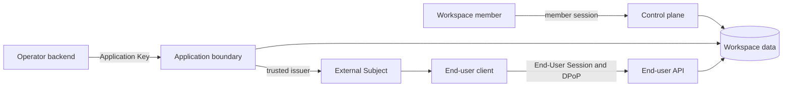

## Identity model

An **Operator** is the workspace customer that builds and operates workflows.
An **Application** is one deployed product boundary through which those
workflows reach End Users. Staging and production are separate Applications.

An **External Subject** is Linea&apos;s canonical representation of an End User
within a workspace and identity issuer. It is not a Linea account or workspace
member.

## Credential boundaries

| Credential       | Can                                                         | Cannot                                                    |
| ---------------- | ----------------------------------------------------------- | --------------------------------------------------------- |
| Member session   | Perform actions allowed by the workspace role               | Act as an external End User                               |
| Workspace Key    | Use explicitly granted workspace operations                 | Substitute for an Application Key or End-User Session     |
| Application Key  | Access one Application&apos;s server-side runtime resources | Cross Applications or change identity trust configuration |
| End-User Session | Act within its subject, Application, audience, and scopes   | Administer the workspace or act for another subject       |

## Data boundary

Repositories accept workspace identity as part of their query contract. Where a
child identifier could be guessed or replayed, composite ownership constraints
prevent it from escaping the parent workspace or Application.

<Callout type="warn" title="Never move secrets into the client">
  Application Keys, Workspace Keys, provider credentials, and connector refresh
  tokens remain server-side. A browser receives only the narrow End-User Session
  capability intended for that boundary.
</Callout>
