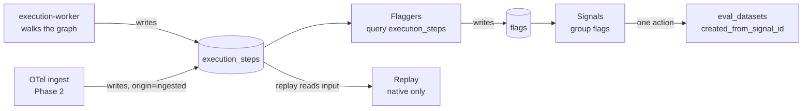

# Execution architecture

The data model behind `roadmap.md`'s wedge and `poc-phase-0.md`'s work items.
Where those two docs say "the runtime schema" or "`execution_steps` is
OTel-shaped," this doc is the answer to "shaped how, exactly."

Companion to `repo-structure.md`, which lays out the four apps and their
`packages/*` dependencies. This doc lays out what they all read and write.

## Terminology

One instance of a workflow running is an **execution**, not a "run." The
codebase already committed to this: `audit-log.ts` has an `execution.*`
enum, `notification.ts` links to `/executions/xyz`, and the worker app is
`execution-worker`, not `run-worker`. Every table and column below follows
that. `roadmap.md` and `poc-phase-0.md` use "run" informally in prose; this
doc is the naming source of truth for anything that becomes a table, column,
or API path.

## Three design principles

Stated once here rather than repeated at every table, because they explain
why several columns exist before the phase that uses them does.

**1. `execution_steps` is a product surface, not a debug log.** It is read by
a human in the Phase 0 trace, replayed from in Phase 1, queried by flaggers in
Phase 1, scored into eval datasets in Phase 3, and matched against foreign
spans in Phase 2. Execution history cannot be backfilled — a column missing
in Phase 0 is missing from every execution that happened before someone
notices. This is the table worth spending the most design time on, and it is
why it gets its own section below.

**2. Workflow versions are immutable and executions bind to one at trigger
time.** `workflow_versions` is append-only. An execution stores
`workflowVersionId` once, at creation, and never follows a live pointer to
"whatever the workflow currently is." Without this, replaying a step from
three weeks ago could run against a graph that no longer matches what
actually happened.

**3. Nothing is deleted; state is derived, not duplicated.** `executions`
stores `status`; nothing else stores a cached copy of it. `workflows`
stores `publishedVersionId` as the one exception, because "what's the
current published version" is a hot read on every trigger and a `MAX()` scan
is worse than a foreign key kept in sync on publish. Every other derived
fact (is this execution replayable, how many steps did it have) is computed
at query time.

## Phase 0 schema

Existing schema covers auth only: `users`, `sessions`, `organizations`,
`members`, `invitations`, `audit_logs`, `notifications`. A workspace is an
`organizations` row. Every new table below scopes to it via `workspace_id`
(the FK target is `organizations.id`; the column is named `workspace_id`,
matching the product term, not `organization_id`, which only
`audit_logs`/`members` use because they predate the workspace vocabulary
being settled).

### `workflows`

| Column                     | Type                                         | Notes                           |
| -------------------------- | -------------------------------------------- | ------------------------------- |
| `id`                       | `uuid` pk                                    |                                 |
| `workspace_id`             | `uuid` fk → `organizations.id`, cascade      |                                 |
| `name`                     | `text`                                       |                                 |
| `slug`                     | `text`                                       | unique per workspace            |
| `published_version_id`     | `uuid` fk → `workflow_versions.id`, nullable | null until first publish        |
| `archived_at`              | `timestamp`, nullable                        | soft archive, never hard delete |
| `created_at`, `updated_at` | `timestamp`                                  |                                 |

Indexes: `(workspace_id, slug)` unique, `(workspace_id)` for the list view.

### `workflow_versions`

| Column         | Type                                | Notes                                                                              |
| -------------- | ----------------------------------- | ---------------------------------------------------------------------------------- |
| `id`           | `uuid` pk                           |                                                                                    |
| `workflow_id`  | `uuid` fk → `workflows.id`, cascade |                                                                                    |
| `version`      | `integer`                           | monotonic per workflow, not a hash — ordering must be unambiguous                  |
| `graph`        | `jsonb`                             | the workflow JSON, validated against `packages/runtime`'s zod schema before insert |
| `content_hash` | `text`                              | sha256 of `graph`, for the dedupe check on save-without-changes                    |
| `published_at` | `timestamp`, nullable               | null = draft                                                                       |
| `created_at`   | `timestamp`                         |                                                                                    |

Indexes: `(workflow_id, version)` unique. Rows are never updated after
insert, only inserted.

### `executions`

The header row for one execution. Shaped closer to a trace than to a job.

```typescript
export const executionStatus = pgEnum("execution_status", [
  "queued",
  "running",
  "paused",
  "succeeded",
  "failed",
  "cancelled",
])

export const executionOrigin = pgEnum("execution_origin", [
  "native", // executed by execution-worker — replayable
  "ingested", // arrived via OTel ingest (Phase 2) — observation only
])

export const executionTrigger = pgEnum("execution_trigger", [
  "manual",
  "schedule",
  "webhook",
  "api",
])

export const executions = snakeCase.table(
  "executions",
  {
    id: uuid().defaultRandom().primaryKey(),
    workspaceId: uuid()
      .notNull()
      .references(() => organizations.id, { onDelete: "cascade" }),
    workflowId: uuid()
      .notNull()
      .references(() => workflows.id, { onDelete: "cascade" }),
    workflowVersionId: uuid()
      .notNull()
      .references(() => workflowVersions.id),

    status: executionStatus().notNull().default("queued"),
    origin: executionOrigin().notNull().default("native"),
    trigger: executionTrigger().notNull(),
    triggerPayload: jsonb().$type<Record<string, unknown>>(),

    // Lease — no separate lease table, see poc-phase-0.md's deviation note
    leasedBy: text(),
    leaseExpiresAt: timestamp({ withTimezone: true }),

    error: jsonb().$type<{ message: string; stepId?: string }>(),

    costMicros: bigint({ mode: "bigint" }).notNull().default(0n),
    tokensInput: integer().notNull().default(0),
    tokensOutput: integer().notNull().default(0),

    startedAt: timestamp({ withTimezone: true }),
    completedAt: timestamp({ withTimezone: true }),
    createdAt: timestamp({ withTimezone: true }).defaultNow().notNull(),
  },
  (table) => [
    index("executions_workflow_created_idx").on(
      table.workflowId,
      table.createdAt
    ),
    index("executions_workspace_created_idx").on(
      table.workspaceId,
      table.createdAt
    ),
    index("executions_lease_claim_idx")
      .on(table.status, table.leaseExpiresAt)
      .where(sql`${table.status} = 'running'`),
  ]
)
```

`costMicros` is a `bigint`, never a JS `number` — same reasoning as
lamport/microLamport handling elsewhere: money-shaped integers should never
touch floating point, and a `number` column silently loses precision at a
scale this product will eventually hit.

**Replayability is computed, not stored:** an execution is replayable when
`origin = 'native'` and `status` is terminal. No `is_replayable` column,
because a stored boolean is a second source of truth that can drift from the
two columns that actually determine it.

### `execution_steps`

The table everything else in this doc hangs off. One row per node attempt,
shaped so it maps cleanly onto an OpenTelemetry span — the left four columns
below are the span, the rest are Linea's own.

```typescript
export const stepStatus = pgEnum("step_status", [
  "running",
  "succeeded",
  "failed",
  "skipped",
])

export const executionSteps = snakeCase.table(
  "execution_steps",
  {
    id: uuid().defaultRandom().primaryKey(),
    executionId: uuid()
      .notNull()
      .references(() => executions.id, { onDelete: "cascade" }),
    workspaceId: uuid().notNull(), // denormalized from executions, every hot query filters by it

    // --- OTel span shape ---
    traceId: text().notNull(), // = executions.id as a hex trace id, or the foreign trace id if ingested
    spanId: text().notNull(),
    parentSpanId: text(),
    name: text().notNull(), // node type, e.g. "http", "ai"
    startedAt: timestamp({ withTimezone: true }).notNull(),
    endedAt: timestamp({ withTimezone: true }),
    status: stepStatus().notNull().default("running"),
    attributes: jsonb().$type<Record<string, unknown>>(), // OTel GenAI attribute bag

    // --- Linea-specific ---
    nodeId: text().notNull(), // id within workflow_versions.graph
    sequence: integer().notNull(), // position in this execution's walk order
    attempt: integer().notNull().default(1), // retries within one engine pass
    input: jsonb().$type<Record<string, unknown>>(),
    output: jsonb().$type<Record<string, unknown>>(),
    error: jsonb().$type<{ message: string; stack?: string }>(),
    idempotencyKey: text(),
    costMicros: bigint({ mode: "bigint" }).notNull().default(0n),
    tokensInput: integer().notNull().default(0),
    tokensOutput: integer().notNull().default(0),

    // --- Phase 1: unused in Phase 0, present now because the column
    //     cannot be added to historical rows later ---
    replayedFromStepId: uuid(), // self-fk, no .references() to avoid a
    // circular table definition; enforced at
    // the application layer
  },
  (table) => [
    index("execution_steps_execution_seq_idx").on(
      table.executionId,
      table.sequence
    ),
    index("execution_steps_trace_idx").on(table.traceId),
    uniqueIndex("execution_steps_idempotency_uidx")
      .on(table.executionId, table.idempotencyKey)
      .where(sql`${table.idempotencyKey} is not null`),
  ]
)
```

Two things worth calling out explicitly:

- **`idempotencyKey` closes half the at-least-once gap described in
  `poc-phase-0.md`.** A node handler that supports idempotency keys (most
  HTTP APIs with a `Idempotency-Key` header) can pass this value through, so
  a retried step doesn't double-execute the side effect even though the graph
  step itself is at-least-once. The unique index makes a duplicate the
  handler's problem to detect, not the database's to silently allow.
- **`replayedFromStepId` is the one column in Phase 0 that Phase 0 never
  writes.** It exists now because retrofitting it means every execution
  before the column existed is permanently un-replayable-from. Adding a
  nullable column costs one migration; adding it a year late costs a
  permanent gap in the product's own history.

### `checkpoints`

```
id, execution_id (fk), sequence (int), completed_step_ids (jsonb array of
execution_steps.id), context (jsonb — variable/output state snapshot needed
to resume), created_at
```

Indexes: `(execution_id, sequence)` unique. Resume reads
`SELECT * FROM checkpoints WHERE execution_id = $1 ORDER BY sequence DESC LIMIT 1`.
Written in the same transaction as the `execution_steps` insert it
corresponds to — see `poc-phase-0.md` item 4.

### `schedules`

```
id, workflow_id (fk), workspace_id, cron_expression, timezone, enabled,
next_run_at, last_run_at, created_at
```

Indexes: `(next_run_at) where enabled` — the poller's only query.

### `secrets`

Named `secrets`, not `workspace_secrets`, to match the `secret.*` audit
resource already in `audit-log.ts`.

```
id, workspace_id (fk), key, encrypted_value, created_at, updated_at
```

Indexes: `(workspace_id, key)` unique.

### `api_keys`

```
id, workspace_id (fk), name, hashed_key, key_prefix, last_used_at,
created_at, revoked_at
```

Indexes: `(hashed_key)` unique, for the auth guard's one lookup.

## Phase 1 preview: flags and signals

Not built in Phase 0. Sketched here because item 1's risk mitigation in
`poc-phase-0.md` requires confirming these can be built from the Phase 0
schema without a new column on `execution_steps` — they can, since flaggers
are pure queries over `execution_steps`/`executions` plus a couple of new
tables of their own.

### `flags`

One row per detector firing on one execution or one step.

```
id, workspace_id, execution_id (fk), execution_step_id (fk, nullable —
graph-level flags like a retry storm attach to the execution, not one step),
flag_type (enum: tool_error, empty_response, refusal, frustration,
retry_storm, dead_branch, cost_anomaly, iteration_ceiling, repeated_resume),
detail (jsonb), created_at
```

### `signals`

A named, tracked group of flags.

```
id, workspace_id, workflow_id (fk), name, status (enum: open, monitoring,
resolved), flag_type, first_seen_at, last_seen_at, occurrence_count
```

### `signal_flags`

Join table, `(signal_id, flag_id)`. A flag joins a signal when it matches the
signal's grouping key (currently just `flag_type` + `workflow_id`; semantic
grouping is a later refinement, not a Phase 1 requirement).

## Phase 2 preview: OTel ingest

No new tables. The ingest endpoint in `run-gateway` (or `platform-api` — not
yet decided which app owns it, flagged as an open question below) writes
directly into `executions` (with `origin = 'ingested'`) and `execution_steps`,
mapping OTel GenAI span attributes onto the `attributes` jsonb column and the
handful of typed columns (`name`, timestamps, `status`) that already exist for
exactly this reason.

`api_keys` gains a `purpose` column (`enum: platform, ingest`) rather than a
new table, so an ingest-only key can be scoped narrower than a full platform
key.

## Phase 3 preview: evals

```
eval_datasets      (id, workspace_id, workflow_id, name, created_from_signal_id nullable)
eval_dataset_items  (id, dataset_id, source_execution_step_id nullable, input, expected)
eval_graders        (id, dataset_id, kind: exact_match | structural | llm_judge, config)
eval_runs           (id, dataset_id, workflow_version_id, triggered_by, started_at, completed_at)
eval_scores          (id, eval_run_id, dataset_item_id, grader_id, score, detail)
```

`eval_datasets.created_from_signal_id` is the column that makes "evals
generated from a signal" (`roadmap.md`, Phase 3) a real feature rather than a
slogan: a dataset created this way pre-populates its items from the signal's
flagged executions instead of starting empty.

## Data flow: how one execution becomes a signal becomes an eval



The point of drawing it this way: `execution_steps` is the only table both
paths (native execution and OTel ingest) write into, and it's the only table
flaggers read from. Everything downstream of Phase 0 is a new consumer of a
table that already exists, not a new pipeline.

## Ownership: who reads and writes what

Mirrors the per-app dependency notes in `repo-structure.md`.

| Table                            | Written by                                                                                            | Read by                                                                         |
| -------------------------------- | ----------------------------------------------------------------------------------------------------- | ------------------------------------------------------------------------------- |
| `workflows`, `workflow_versions` | `platform-api` (create/publish)                                                                       | `execution-worker`, `platform-api`, `apps/web`                                  |
| `executions`                     | `execution-worker` (status/lease), `platform-api` (create on trigger), OTel ingest endpoint (Phase 2) | `platform-api` (list/get), `apps/web`                                           |
| `execution_steps`                | `execution-worker` only in Phase 0; OTel ingest endpoint added in Phase 2                             | `platform-api`, `apps/web`, flaggers (Phase 1), eval dataset creation (Phase 3) |
| `checkpoints`                    | `execution-worker` only                                                                               | `execution-worker` (resume)                                                     |
| `schedules`                      | `platform-api` (CRUD), `background-worker` (advances `next_run_at`)                                   | `background-worker`                                                             |
| `secrets`                        | `platform-api`                                                                                        | `execution-worker` (resolves at node execution)                                 |
| `api_keys`                       | `platform-api`                                                                                        | `platform-api` (auth guard), ingest endpoint (Phase 2)                          |

`execution-worker` is the only writer of `execution_steps` and `checkpoints`
in Phase 0 — no other app touches either table directly, which is what keeps
the crash-and-resume invariant in `poc-phase-0.md` enforceable: if two
services could write a checkpoint, "resume from the last checkpoint" stops
being well-defined.

## Open questions this doc doesn't resolve

- **Which app owns OTel ingest, `run-gateway` or `platform-api`.**
  `repo-structure.md` reserves `run-gateway` for sandbox-adjacent traffic and
  keeps `platform-api` as the general CRUD/API surface; ingest is neither,
  it's closer to `platform-api`'s existing job of being the thing outside
  callers hit. Leaning `platform-api`, decide when Phase 2 starts.
- **Whether `attributes` jsonb needs a GIN index.** Depends on whether Phase 1
  flaggers query into it directly or only read the typed columns. Defer until
  a real flagger query exists to measure against.
- **`workflow_versions.graph` size ceiling.** No cap specified yet. Revisit
  once a real workflow's JSON size is known instead of guessing.
